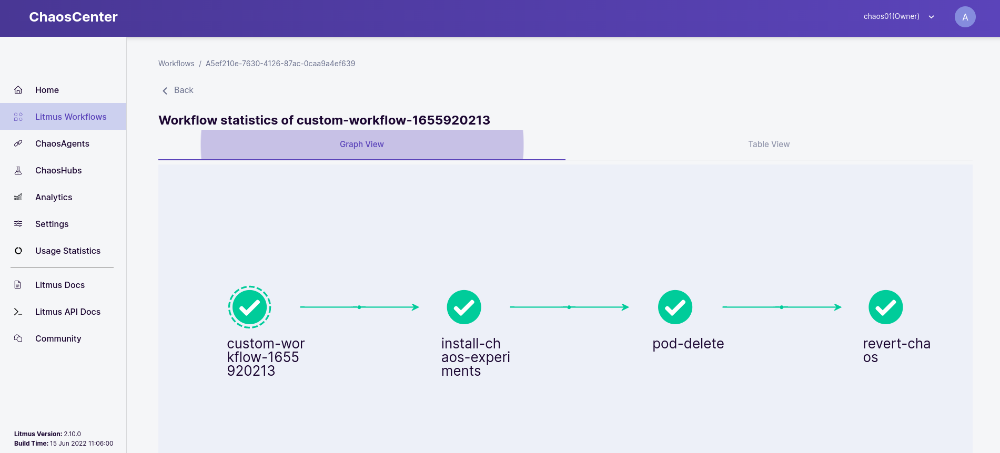
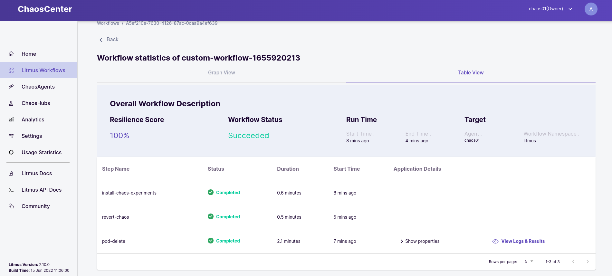

# Chaos Engineering in Openshift 4

This repository tries to collect information about chaos engineering in Openshift 4 based on Litmus.

[LitmusChaos](https://docs.litmuschaos.io/docs/introduction/what-is-litmus) is a Cloud-Native Chaos Engineering Framework with cross-cloud support. It is a CNCF Sandbox project with adoption across several organizations. Its mission is to help Kubernetes SREs and Developers to find weaknesses in both Non-Kubernetes as well as platforms and applications running on Kubernetes by providing a complete Chaos Engineering framework and associated Chaos Experiments.

## Prerequisites

The following tools and clients are required to execute the procedures included in this document:

- Openshift 4.10+
- [OC Client](https://docs.openshift.com/container-platform/4.10/cli_reference/openshift_cli/getting-started-cli.html)
- [Helm](https://helm.sh/docs/intro/install/)
- [litmusctl](https://github.com/litmuschaos/litmusctl/blob/master/README.md)
- [jq](https://stedolan.github.io/jq/download/)
- [k6](https://k6.io/docs/getting-started/installation/)

## Setting Up

The following procedure explains how to deploy and configure Litmus from the command line using different tools and clients. 

Please follow every step included below to deploy Litmus in Openshift:

- Create a required namespace for Litmus and install the solution using Helm

```$bash
oc new-project litmus

helm repo add litmuschaos https://litmuschaos.github.io/litmus-helm

helm install chaos litmuschaos/litmus --namespace=litmus -f examples/override-openshift.yaml
```

- In order to allow the Litmus pods to run, it is required to assign some permission to the SAs

```$bash
oc adm policy add-scc-to-user anyuid -z litmus-server-account
oc adm policy add-scc-to-user anyuid -z default
```

- Modify Litmus server deployment to add some important environment variable

```$bash
oc expose svc/chaos-litmus-frontend-service
oc get route chaos-litmus-frontend-service -n litmus --template='{{ .spec.host }}'

oc edit deployment chaos-litmus-server

        - name: CHAOS_CENTER_UI_ENDPOINT
          value: http://<CHAOS_LITMUS_FRONTEND_SERVICE>
```

- Finally, access to the Litmus frontend service published (*admin:litmus*)

```$bash
oc get route chaos-litmus-frontend-service -n litmus --template='{{ .spec.host }}'
```


## Deploy Chaos Agent

Once the Litmus solution is deployed and the frontend accessible, it is time to create an agent. 

Litmus Agent Infrastructure components help facilitate the chaos injection, manage chaos observability, and enable chaos automation for target resources.

In order to create an agent to manage the Chaos Engineering tests, it is required to follow the next steps:

- Create Litmus Account config

```$bash
oc get route chaos-litmus-frontend-service -n litmus --template='{{ .spec.host }}'

litmusctl config set-account  --endpoint "http://<CHAOS_LITMUS_FRONTEND_SERVICE>" --password "litmus" --username "admin"
```

- Create a Litmus project and the Chaos agent

```$bash
litmusctl create project --name="chaos01"

litmusctl get projects -o json |  jq '.[] | select(.Name=="chaos01") ' | jq '.ID'

litmusctl create agent --agent-name="chaos01" --installation-mode="cluster" --namespace="litmus" --non-interactive=true --project-id=<PROJECT_ID> --skipSSL --service-account="default" --skip-agent-ssl --platform-name="Openshift"
```

WARNING: It is possible the agent deployment does not deploy the required pods correctly. In this case, it is required to modify SAs permission to run the pods with specific configuration following the next procedure: 

```$bash
for i in $(oc get sa | grep -v NAME | awk '{ print $1}'); do oc adm policy add-scc-to-user anyuid -z $i; done
oc get deployment | grep "0/1" | awk '{ print "oc scale --replicas=0 deployment/" $1}' | sh
oc get deployment | grep "0/0" | awk '{ print "oc scale --replicas=1 deployment/" $1}' | sh
```

- Finally, check the respective pods are running properly

```$bash
oc get pods -n litmus

NAME                                        READY   STATUS    RESTARTS         AGE
chaos-exporter-7db76cb587-cvd6k             1/1     Running   2                41h
chaos-litmus-auth-server-66b84b7f57-8gkpq   1/1     Running   2                45h
chaos-litmus-frontend-8486dcd586-9xbg6      1/1     Running   8 (5h22m ago)    45h
chaos-litmus-mongo-0                        1/1     Running   2                46h
chaos-litmus-server-7fc95794d4-dm9nt        1/1     Running   2                42h
chaos-operator-ce-fd444fb88-hd4ld           1/1     Running   2                41h
event-tracker-7f9d575854-55pb6              1/1     Running   2                41h
subscriber-576d477bcb-h44qg                 1/1     Running   13 (5h22m ago)   42h
workflow-controller-6d9db4b978-2ztz6        1/1     Running   2                41h
```

## Prepare Testing Environment 

These sections include the required procedures to deploy an application, names *Jump App*, and prepare the user load emulator (*k6*).

### Deploy Jump App

First of all, it is required to deploy the test application that will be affected by the chaos engineering tests. The idea is to define an optimal configuration in order to resist the chaos engineering test.

Please execute the following procedure to deploy *Jump App*:

- Define the Openshift's application domain correctly

```$bash
DOMAIN="<ocp_apps_domain>" (E.g. apps.chaos.sandbox1817.opentlc.com)
sed "s|apps.chaos.sandbox1817.opentlc.com|$DOMAIN|g" -i ocp/jump-app.yaml
```

- Deploy the application

```$bash
oc apply -f ocp/jump-app.yaml
```

- Check the application's pods

```$bash
oc get pods -n jump-app-dev
NAME                                   READY   STATUS    RESTARTS   AGE
back-golang-v1-7844f5d7cc-v879m       1/1     Running   0          2m18s
back-python-v1-6c76df74d7-r26nf       1/1     Running   0          2m18s
back-quarkus-v1-58b8c499cc-bng6c      1/1     Running   0          2m17s
back-quarkus-v2-555984b5b9-ppbzm      1/1     Running   0          2m17s
back-springboot-v1-7c64f6b789-xbk6v   1/1     Running   0          2m17s
front-javascript-v1-75c548bd9-t4tcz   1/1     Running   0          2m16s
```

- Access *Jump App* backend

```$bash
HOST=$(oc get route back-golang -n jump-app-dev --template='{{ .spec.host }}')

curl -k -H "Content-type: application/json" -d '{
    "message": "Hello",
    "last_path": "/jump",
    "jump_path": "/jump",
    "jumps": [
        "http://back-golang-v1:8442",
        "http://back-springboot-v1:8443",
        "http://back-python-v1:8444",
        "http://back-quarkus:8445"
    ]
}' https://$HOST/jump

...
{"code":200,"message":"/jump - Greetings from Quarkus!"}%
```

### User Load Emulator

Grafana [k6](https://k6.io/docs/) is an open-source load testing tool that makes performance testing easy and productive for engineering teams. k6 is free, developer-centric, and extensible.

Using k6, you can test the reliability and performance of your systems and catch performance regressions and problems earlier. k6 will help you to build resilient and performant applications that scale.

In order to execute the k6 test, it is required to execute the following procedure:

- Define the Openshift's application domain correctly

```$bash
HOST=$(oc get route back-golang -n jump-app-dev --template='{{ .spec.host }}')
URL="https://$HOST/jump"
```

- Execute the HTTP POST test

```$bash
TEST_URL=$URL k6 run --vus 10 --duration 1s k6/k6-post-test.js

...
running (01.4s), 00/10 VUs, 10 complete and 0 interrupted iterations
default ✓ [======================================] 10 VUs  1s

     ✓ status was 200

     checks.........................: 100.00% ✓ 10       ✗ 0   
     data_received..................: 36 kB   25 kB/s
     data_sent......................: 7.6 kB  5.3 kB/s
     http_req_blocked...............: avg=224.91ms min=209.41ms med=224.95ms max=240.92ms p(90)=240.83ms p(95)=240.87ms
     http_req_connecting............: avg=112.78ms min=103.67ms med=113.09ms max=120.73ms p(90)=120.71ms p(95)=120.72ms
     http_req_duration..............: avg=169.56ms min=140.38ms med=176.26ms max=191.19ms p(90)=187.65ms p(95)=189.42ms
       { expected_response:true }...: avg=169.56ms min=140.38ms med=176.26ms max=191.19ms p(90)=187.65ms p(95)=189.42ms
     http_req_failed................: 0.00%   ✓ 0        ✗ 10  
     http_req_receiving.............: avg=133.87µs min=80.72µs  med=127.96µs max=183.92µs p(90)=182.54µs p(95)=183.23µs
     http_req_sending...............: avg=70.16µs  min=26.13µs  med=57.2µs   max=133.83µs p(90)=128.63µs p(95)=131.23µs
     http_req_tls_handshaking.......: avg=111.52ms min=105.18ms med=111.2ms  max=119.47ms p(90)=119.47ms p(95)=119.47ms
     http_req_waiting...............: avg=169.36ms min=140.08ms med=176.01ms max=191.05ms p(90)=187.51ms p(95)=189.28ms
     http_reqs......................: 10      6.982739/s
     iteration_duration.............: avg=1.39s    min=1.35s    med=1.4s     max=1.42s    p(90)=1.42s    p(95)=1.42s   
     iterations.....................: 10      6.982739/s
     vus............................: 10      min=10     max=10
     vus_max........................: 10      min=10     max=10

```

NOTE: k6 will generate user load during the chaos engineering tests execution in order to check the *Jump App* resilience

## Chaos Engineering Tests

Once Litmus, the respective agent and the testing environment are deployed, it is possible to execute a *Litmus Workflow* in order to generate the chaos engineering test. 

A *Chaos Workflow* is a set of different operations coupled together to achieve desired chaos impact on a Kubernetes Cluster. It is useful in automating a series of pre-conditioning steps or action which is necessary to be performed before triggering the chaos injection.

The following subsections collect the required procedures to execute a set of chaos engineering tests against *Jump App* deployed in an Openshift cluster.

### Test 01 (Non Resilient Configuration - KO)

During this test, the kaos engineering test will delete 80% of the pods, in this case the 1/1 replicas, every 30 secs over 2 minutes. The *Jump App* configuration makes some service loss appear during the chaos test execution.

Please execute the following procedure to perform the chaos test and collect the respective information:

- Execute the HTTP POST user load (*This process is running during the chaos test execution*)

```$bash
TEST_URL=$URL k6 run --vus 10 --duration 600s k6/k6-post-test.js
```

- Execute a new *Litmus Workflow*

```$bash
# Visit Litmus Frontend
oc get route chaos-litmus-frontend-service -n litmus --template='{{ .spec.host }}'

# Go to "Litmus Workflows -> Schedule a Workflow"
 - Select chaos01 Agent
 - Import a workflow using YAML
 - Execute the chaos engineering test
```

- Review the *Litmus Workflow* result





- Review the pods in order to see the pods deletion

```$bash
oc get pods -n jump-app-dev
NAME                                   READY   STATUS    RESTARTS   AGE
back-golang-v1-7844f5d7cc-89prb       1/1     Running   0          12m26s
back-python-v1-6c76df74d7-28cpv       1/1     Running   0          12m26s
back-quarkus-v1-7dfb678b9f-gw5sh      1/1     Running   0          78s    <-------
back-quarkus-v2-74cf8cd8dc-cdhzn      1/1     Running   0          12m25s
back-springboot-v1-7c64f6b789-jt8wr   1/1     Running   0          12m25s
front-javascript-v1-75c548bd9-k5wqz   1/1     Running   0          12m25s
```

- Review the HTTP POST user load

```$bash
...
running (10m01.8s), 00/10 VUs, 5075 complete and 0 interrupted iterations
default ✓ [======================================] 10 VUs  10m0s

     ✗ status was 200
      ↳  99% — ✓ 5039 / ✗ 36

     checks.........................: 99.29% ✓ 5039    ✗ 36  
     data_received..................: 3.9 MB 6.4 kB/s
     data_sent......................: 1.9 MB 3.1 kB/s
     http_req_blocked...............: avg=2.06ms   min=1.12µs   med=4.04µs   max=923.66ms p(90)=10.36µs  p(95)=12.57µs 
     http_req_connecting............: avg=889.41µs min=0s       med=0s       max=153.64ms p(90)=0s       p(95)=0s      
     http_req_duration..............: avg=180ms    min=100.61ms med=138.05ms max=7.3s     p(90)=213.07ms p(95)=245.6ms 
       { expected_response:true }...: avg=175.39ms min=110.29ms med=138.15ms max=7.3s     p(90)=212ms    p(95)=244.84ms
     http_req_failed................: 0.70%  ✓ 36      ✗ 5039
     http_req_receiving.............: avg=225.74µs min=0s       med=163.34µs max=1.55ms   p(90)=418.44µs p(95)=486.86µs
     http_req_sending...............: avg=23.15µs  min=5.15µs   med=14.81µs  max=1.47ms   p(90)=47.78µs  p(95)=55.95µs 
     http_req_tls_handshaking.......: avg=1.01ms   min=0s       med=0s       max=800.53ms p(90)=0s       p(95)=0s      
     http_req_waiting...............: avg=179.75ms min=100.13ms med=137.82ms max=7.3s     p(90)=212.78ms p(95)=245.3ms 
     http_reqs......................: 5075   8.43295/s
     iteration_duration.............: avg=1.18s    min=1.11s    med=1.13s    max=8.3s     p(90)=1.22s    p(95)=1.25s   
     iterations.....................: 5075   8.43295/s
     vus............................: 4      min=4     max=10
     vus_max........................: 10     min=10    max=10
```

NOTE: As the previous k6 test load result shows, there have been some requests lost

### Test 02 (Partial Resilient Configuration - KO)

During this test, the kaos engineering test will delete 80% of the pods, in this case the 4/5 replicas, every 30 secs over 2 minutes. The *Jump App* configuration avoids the most part of the service loss during the chaos test execution.

Please execute the following procedure to perform the chaos test and collect the respective information:

- Extend the number of replicas

```$bash
for i in $(oc get deployment -n jump-app-dev | grep -v NAME | awk '{ print $1}'); do oc scale --replicas=5 deployment/$i -n jump-app-dev; done
```

- Execute the HTTP POST user load (*This process is running during the chaos test execution*)

```$bash
TEST_URL=$URL k6 run --vus 10 --duration 600s k6/k6-post-test.js
```

- Execute a new *Litmus Workflow*

```$bash
# Visit Litmus Frontend
oc get route chaos-litmus-frontend-service -n litmus --template='{{ .spec.host }}'

# Go to "Litmus Workflows -> Schedule a Workflow"
 - Select chaos01 Agent
 - Import a workflow using YAML
 - Execute the chaos engineering test

```

- Review the pods in order to see the pods deletion

```$bash
oc get pods -n jump-app-dev
NAME                                   READY   STATUS    RESTARTS       AGE
...
back-golang-v1-7844f5d7cc-xzc6g         1/1     Running   0              5m18s
back-quarkus-v1-6c76df74d7-hr5z6        1/1     Running   0              2m32s  <-------
back-quarkus-v1-6c76df74d7-kxhtm        1/1     Running   0              2m46s  <-------
back-quarkus-v1-6c76df74d7-m72jc        1/1     Running   0              2m32s  <-------
back-quarkus-v1-6c76df74d7-rzlwd        1/1     Running   0              2m32s  <-------
back-quarkus-v1-6c76df74d7-w9v9d        1/1     Running   0              2m32s  <-------
...

```

- Review the HTTP POST user load

```$bash
...
running (10m01.1s), 00/10 VUs, 5237 complete and 0 interrupted iterations
default ✓ [======================================] 10 VUs  10m0s

     ✗ status was 200
      ↳  99% — ✓ 5235 / ✗ 2

     checks.........................: 99.96% ✓ 5235     ✗ 2   
     data_received..................: 3.9 MB 6.5 kB/s
     data_sent......................: 1.9 MB 3.1 kB/s
     http_req_blocked...............: avg=2.03ms   min=1.51µs   med=8.37µs   max=602.32ms p(90)=12.94µs  p(95)=15.71µs 
     http_req_connecting............: avg=678.46µs min=0s       med=0s       max=155.63ms p(90)=0s       p(95)=0s      
     http_req_duration..............: avg=143.34ms min=112.44ms med=136.32ms max=2.16s    p(90)=162.34ms p(95)=179.22ms
       { expected_response:true }...: avg=143.29ms min=112.44ms med=136.32ms max=2.16s    p(90)=162.33ms p(95)=178.94ms
     http_req_failed................: 0.03%  ✓ 2        ✗ 5235
     http_req_receiving.............: avg=301.49µs min=0s       med=326.04µs max=2.33ms   p(90)=455.06µs p(95)=502.76µs
     http_req_sending...............: avg=36.08µs  min=6.55µs   med=38.46µs  max=282.8µs  p(90)=59.29µs  p(95)=67.51µs 
     http_req_tls_handshaking.......: avg=659.92µs min=0s       med=0s       max=133.34ms p(90)=0s       p(95)=0s      
     http_req_waiting...............: avg=143ms    min=112.05ms med=135.99ms max=2.16s    p(90)=162.09ms p(95)=178.78ms
     http_reqs......................: 5237   8.711778/s
     iteration_duration.............: avg=1.14s    min=1.11s    med=1.13s    max=3.16s    p(90)=1.16s    p(95)=1.18s   
     iterations.....................: 5237   8.711778/s
     vus............................: 2      min=2      max=10
     vus_max........................: 10     min=10     max=10
```

NOTE: As the previous k6 test load result shows, everything worked well


### Test 03 (Resilient Configuration based on Red Hat Openshift Service Mesh - OK)

#### Setting Up Red Hat Openshift Service Mesh

First of all, it is required to install the required operators and create a set of resources to deploy the Red Hat Openshift Service Mesh solution based on Istio.

Please follow the next steps to deploy the solution:

- Install Red Hat Openshift Service Mesh operators and deploy the mesh

```$bash
sh scripts/setup_istio.sh
```

- Reload Jump App application pods and restablish the original pod replicas

```$bash
for i in $(oc get deployment -n jump-app-dev | grep -v NAME | awk '{ print $1}'); do oc scale --replicas=1 deployment/$i -n jump-app-dev; don

oc get pods -n jump-app-dev | grep -v NAME | awk '{ print "oc delete pod " $1 " -n jump-app-dev --force --grace-period 0"}' | sh
```

- Delete previous routes

```$bash
oc get routes -n jump-app-dev | grep -v NAME | awk '{ print "oc delete routes " $1 " -n jump-app-dev"}' | sh
```

- Define the Openshift's application domain correctly

```$bash
DOMAIN="<ocp_apps_domain>" (E.g. apps.chaos.sandbox1817.opentlc.com)
sed "s|apps.chaos.sandbox1817.opentlc.com|$DOMAIN|g" -i ocp/jump-app-mesh.yaml
```

- Create the required mesh objects

```$bash
oc apply -f ocp/jump-app-mesh.yaml
```

- Access *Jump App* backend

```$bash
HOST=$(oc get route back-golang -n istio-system --template='{{ .spec.host }}')

curl -k -H "Content-type: application/json" -d '{
    "message": "Hello",
    "last_path": "/jump",
    "jump_path": "/jump",
    "jumps": [
        "http://back-golang-v1:8442",
        "http://back-springboot-v1:8443",
        "http://back-python-v1:8444",
        "http://back-quarkus:8445"
    ]
}' https://$HOST/jump

...
{"code":200,"message":"/jump - Greetings from Quarkus!"}%
```

#### Execute the test

During this test, the kaos engineering test will delete 80% of the pods, in this case the 4/5 replicas, every 30 secs over 2 minutes. The *Jump App* configuration and Red Hat Openshift Service Mesh make possible to avoid all service loss during the chaos test execution.

Please execute the following procedure to perform the chaos test and collect the respective information:

- Extend the number of replicas

```$bash
for i in $(oc get deployment -n jump-app-dev | grep -v NAME | awk '{ print $1}'); do oc scale --replicas=1 deployment/$i -n jump-app-dev; done
```

- Execute the HTTP POST user load (*This process is running during the chaos test execution*)

```$bash
TEST_URL=$URL k6 run --vus 10 --duration 600s k6/k6-post-test.js
```

- Execute a new *Litmus Workflow*

```$bash
# Visit Litmus Frontend
oc get route chaos-litmus-frontend-service -n litmus --template='{{ .spec.host }}'

# Go to "Litmus Workflows -> Schedule a Workflow"
 - Select chaos01 Agent
 - Import a workflow using YAML
 - Execute the chaos engineering test

```

- Review the pods in order to see the pods deletion

```$bash
oc get pods -n jump-app-dev
NAME                                   READY   STATUS    RESTARTS   AGE
back-golang-v1-7844f5d7cc-89prb       1/1     Running   0          12m26s
back-python-v1-6c76df74d7-28cpv       1/1     Running   0          12m26s
back-quarkus-v1-7dfb678b9f-gw5sh      1/1     Running   0          78s    <-------
back-quarkus-v2-74cf8cd8dc-cdhzn      1/1     Running   0          12m25s
back-springboot-v1-7c64f6b789-jt8wr   1/1     Running   0          12m25s
front-javascript-v1-75c548bd9-k5wqz   1/1     Running   0          12m25s
...

```

- Review the HTTP POST user load

```$bash
...
running (10m01.1s), 00/10 VUs, 5220 complete and 0 interrupted iterations
default ✓ [======================================] 10 VUs  10m0s

     ✓ status was 200

     checks.........................: 100.00% ✓ 5220     ✗ 0   
     data_received..................: 4.7 MB  7.7 kB/s
     data_sent......................: 1.9 MB  3.1 kB/s
     http_req_blocked...............: avg=530.44µs min=1.09µs   med=7.33µs   max=282.18ms p(90)=12.21µs  p(95)=15.09µs 
     http_req_connecting............: avg=240.3µs  min=0s       med=0s       max=125.62ms p(90)=0s       p(95)=0s      
     http_req_duration..............: avg=148.92ms min=119.06ms med=137.57ms max=617.47ms p(90)=182.3ms  p(95)=210.63ms
       { expected_response:true }...: avg=148.92ms min=119.06ms med=137.57ms max=617.47ms p(90)=182.3ms  p(95)=210.63ms
     http_req_failed................: 0.00%   ✓ 0        ✗ 5220
     http_req_receiving.............: avg=270.58µs min=71.25µs  med=227.93µs max=6.71ms   p(90)=457.95µs p(95)=514.98µs
     http_req_sending...............: avg=29.32µs  min=5.67µs   med=23.84µs  max=356.57µs p(90)=53.16µs  p(95)=61.4µs  
     http_req_tls_handshaking.......: avg=216.43µs min=0s       med=0s       max=122.02ms p(90)=0s       p(95)=0s      
     http_req_waiting...............: avg=148.62ms min=118.87ms med=137.3ms  max=617.03ms p(90)=181.98ms p(95)=210.32ms
     http_reqs......................: 5220    8.683417/s
     iteration_duration.............: avg=1.15s    min=1.12s    med=1.13s    max=1.61s    p(90)=1.18s    p(95)=1.21s   
     iterations.....................: 5220    8.683417/s
     vus............................: 3       min=3      max=10
     vus_max........................: 10      min=10     max=10
```

After the test is finished, it is possible to find a **0% error rate**. Thanks to the Red Hat Openshift Service Mesh configuration, it is possible to avoid service loss when any microservices errors appear. The configuration that supports this model is the following:

- **Retries**: Define a retry policy to use when a HTTP request fails

```$bash
apiVersion: networking.istio.io/v1alpha3
kind: VirtualService
metadata:
  name: back-quarkus
  namespace: jump-app-dev
spec:
  gateways:
  - mesh
  hosts:
  - back-quarkus
  http:
  - route:
      - destination:
          host: back-quarkus.jump-app-dev.svc.cluster.local
          subset: v1
        weight: 100
    retries:                                                     <------- Retry Policy Definition  (Default retry time -> 25ms+).
      attempts: 5                                                <------- Number of maximum retries
      perTryTimeout: 2s                                          <------- Timeout per attempt 
      retryOn: connect-failure,refused-stream,503                <------- The conditions under which retry takes place
```

- **Circuit Breaking**: Circuit breaker implementation that tracks the status of each individual host in the upstream service and ejects failed hosts from the pool for a pre-defined period of time

```$bash
apiVersion: networking.istio.io/v1alpha3
kind: DestinationRule
metadata:
  name: back-quarkus
  namespace: jump-app-dev
spec:
  host: back-quarkus.jump-app-dev.svc.cluster.local
  subsets:
  - name: v1
    labels:
      root: back-quarkus
    trafficPolicy:                           <------- Traffic Policy Definition
      outlierDetection:                      <------- Settings controlling eviction of unhealthy hosts from the load balancing pool
        consecutive5xxErrors: 2              <------- The number of consecutive locally originated failures before ejection occurs (Def. 5)
        interval: 1m                         <------- Time interval between ejection sweep analysis
        baseEjectionTime: 15m                <------- Minimum ejection duration
```

## Summary

The goal of chaos engineering is to identify weakness in a system through controlled experiments that introduce random and unpredictable behavior. A main benefit of chaos engineering is that organizations can use it to identify vulnerabilities before a hacker does or before a system failure.

Solutions such as Red Hat Openshift Service Mesh allows applications to be more resilient and avoid errors managing the load balancer policies inside Kubernetes with a specific intelligence.

## Author 

Asier Cidon @RedHat