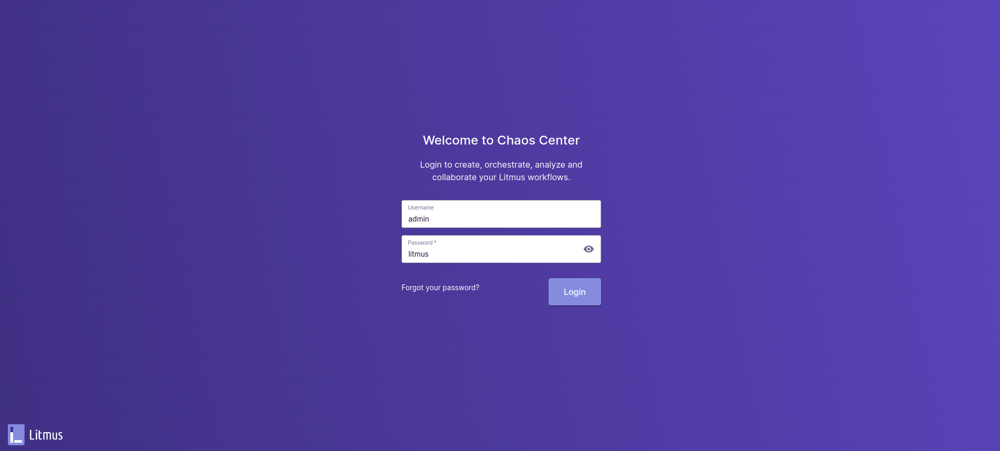

# Chaos Engineering in Openshift 4

This repository tries to collect information about chaos engineering in Openshift 4 based on Litmus.

[LitmusChaos](https://docs.litmuschaos.io/docs/introduction/what-is-litmus) is a Cloud-Native Chaos Engineering Framework with cross-cloud support. It is a CNCF Sandbox project with adoption across several organizations. Its mission is to help Kubernetes SREs and Developers to find weaknesses in both Non-Kubernetes as well as platforms and applications running on Kubernetes by providing a complete Chaos Engineering framework and associated Chaos Experiments.

## Prerequisites

The following tools and clients are required to execute the procedures included in this document:

- Openshift 4.10+
- [OC Client](https://docs.openshift.com/container-platform/4.10/cli_reference/openshift_cli/getting-started-cli.html)
- [Helm](https://helm.sh/docs/intro/install/)
- [litmusctl](https://github.com/litmuschaos/litmusctl/blob/master/README.md)
- [jq](https://stedolan.github.io/jq/download/)
- [k6](https://k6.io/docs/getting-started/installation/)

## Setting Up

The following procedure explains how to deploy and configure Litmus from the command line using different tools and clients. 

Please follow every step included below to deploy Litmus in Openshift:

- Create a required namespace for Litmus and install the solution using Helm

```$bash
oc new-project litmus

helm repo add litmuschaos https://litmuschaos.github.io/litmus-helm

cat <<EOF > override-openshift.yaml
portalScope: namespace
portal.server.service.type: ClusterIP
portal.frontend.service.type: ClusterIP
openshift.route.enabled: true
EOF

helm install chaos litmuschaos/litmus --namespace=litmus -f override-openshift.yaml
```

- In order to allow the Litmus pods to run, it is required to assign some permission to the SAs

```$bash
oc adm policy add-scc-to-user anyuid -z litmus-server-account
oc adm policy add-scc-to-user anyuid -z default
```

- Modify Litmus server deployment to add some important environment variable

```$bash
oc expose svc/chaos-litmus-frontend-service
oc get route chaos-litmus-frontend-service -n litmus --template='{{ .spec.host }}'

oc edit deployment chaos-litmus-server

        - name: CHAOS_CENTER_UI_ENDPOINT
          value: http://<CHAOS_LITMUS_FRONTEND_SERVICE>
```

- Finally, access to the Litmus frontend service published (*admin:litmus*)

```$bash
oc get route chaos-litmus-frontend-service -n litmus --template='{{ .spec.host }}'
```



## Deploy Chaos Agent

Once the Litmus solution is deployed and the frontend accessible, it is time to create an agent. 

Litmus Agent Infrastructure components help facilitate the chaos injection, manage chaos observability, and enable chaos automation for target resources.

In order to create an agent to manage the Chaos Engineering tests, it is required to follow the next steps:

- Create Litmus Account config

```$bash
oc get route chaos-litmus-frontend-service -n litmus --template='{{ .spec.host }}'

litmusctl config set-account  --endpoint "http://<CHAOS_LITMUS_FRONTEND_SERVICE>" --password "litmus" --username "admin"
```

- Create a Litmus project and the Chaos agent

```$bash
litmusctl create project --name="chaos01"

litmusctl get projects -o json |  jq '.[] | select(.Name=="chaos01") ' | jq '.ID'

litmusctl create agent --agent-name="chaos01" --installation-mode="cluster" --namespace="litmus" --non-interactive=true --project-id=<PROJECT_ID> --skipSSL --service-account="default" --skip-agent-ssl --platform-name="Openshift"
```

WARNING: It is possible the agent deployment does not deploy the required pods correctly. In this case, it is required to modify SAs permission to run the pods with specific configuration following the next procedure: 

```$bash
for i in $(oc get sa | grep -v NAME | awk '{ print $1}'); do oc adm policy add-scc-to-user anyuid -z $i; done
oc get deployment | grep "0/1" | awk '{ print "oc scale --replicas=0 deployment/" $1}' | sh
oc get deployment | grep "0/0" | awk '{ print "oc scale --replicas=1 deployment/" $1}' | sh
```

- Finally, check the respective pods are running properly

```$bash
oc get pods -n litmus

NAME                                        READY   STATUS    RESTARTS         AGE
chaos-exporter-7db76cb587-cvd6k             1/1     Running   2                41h
chaos-litmus-auth-server-66b84b7f57-8gkpq   1/1     Running   2                45h
chaos-litmus-frontend-8486dcd586-9xbg6      1/1     Running   8 (5h22m ago)    45h
chaos-litmus-mongo-0                        1/1     Running   2                46h
chaos-litmus-server-7fc95794d4-dm9nt        1/1     Running   2                42h
chaos-operator-ce-fd444fb88-hd4ld           1/1     Running   2                41h
event-tracker-7f9d575854-55pb6              1/1     Running   2                41h
subscriber-576d477bcb-h44qg                 1/1     Running   13 (5h22m ago)   42h
workflow-controller-6d9db4b978-2ztz6        1/1     Running   2                41h
```

## Prepare Testing Environment 

These sections include the required procedures to deploy an application, names *Jump App*, and prepare the user load emulator (*k6*).

### Deploy Jump App

First of all, it is required to deploy the test application that will be affected by the chaos engineering tests. The idea is to define an optimal configuration in order to resist the chaos engineering test.

Please execute the following procedure to deploy *Jump App*:

- Define the Openshift's application domain correctly

```$bash
DOMAIN="<ocp_apps_domain>" (E.g. apps.chaos.sandbox1817.opentlc.com)
sed "s|apps.chaos.sandbox1817.opentlc.com|$DOMAIN|g" -i ocp/jump-app.yaml
```

- Deploy the application

```$bash
oc apply -f ocp/jump-app.yaml
```

- Check the application's pods

```$bash
oc get pods -n jump-app-dev
NAME                                   READY   STATUS    RESTARTS   AGE
back-golang-v1-7844f5d7cc-kjx2f        1/1     Running   0          107s
back-python-v1-6c76df74d7-86j2l        1/1     Running   0          106s
back-quarkus-v1-65748f6b87-rcbrq       1/1     Running   0          106s
back-springboot-v1-7c64f6b789-lv296    1/1     Running   0          105s
front-javascript-v1-598dbf654d-qhth6   1/1     Running   0          105s
```

- Access *Jump App* backend

```$bash
HOST=$(oc get route back-golang -n jump-app-dev --template='{{ .spec.host }}')

curl -k -H "Content-type: application/json" -d '{
    "message": "Hello",
    "last_path": "/jump",
    "jump_path": "/jump",
    "jumps": [
        "http://back-golang-v1:8442",
        "http://back-springboot-v1:8443",
        "http://back-python-v1:8444",
        "http://back-quarkus-v1:8445"
    ]
}' https://$HOST/jump

...
{"code":200,"message":"/jump - Greetings from Quarkus!"}%
```

### User Load Emulator

Grafana [k6](https://k6.io/docs/) is an open-source load testing tool that makes performance testing easy and productive for engineering teams. k6 is free, developer-centric, and extensible.

Using k6, you can test the reliability and performance of your systems and catch performance regressions and problems earlier. k6 will help you to build resilient and performant applications that scale.

In order to execute the k6 test, it is required to execute the following procedure:

- Define the Openshift's application domain correctly

```$bash
HOST=$(oc get route back-golang -n jump-app-dev --template='{{ .spec.host }}')
URL="https://$HOST/jump"
```

- Execute the HTTP POST test

```$bash
TEST_URL=$URL k6 run --vus 10 --duration 1s k6/k6-post-test.js

...
running (01.4s), 00/10 VUs, 10 complete and 0 interrupted iterations
default ✓ [======================================] 10 VUs  1s

     ✓ status was 200

     checks.........................: 100.00% ✓ 10       ✗ 0   
     data_received..................: 36 kB   25 kB/s
     data_sent......................: 7.6 kB  5.3 kB/s
     http_req_blocked...............: avg=224.91ms min=209.41ms med=224.95ms max=240.92ms p(90)=240.83ms p(95)=240.87ms
     http_req_connecting............: avg=112.78ms min=103.67ms med=113.09ms max=120.73ms p(90)=120.71ms p(95)=120.72ms
     http_req_duration..............: avg=169.56ms min=140.38ms med=176.26ms max=191.19ms p(90)=187.65ms p(95)=189.42ms
       { expected_response:true }...: avg=169.56ms min=140.38ms med=176.26ms max=191.19ms p(90)=187.65ms p(95)=189.42ms
     http_req_failed................: 0.00%   ✓ 0        ✗ 10  
     http_req_receiving.............: avg=133.87µs min=80.72µs  med=127.96µs max=183.92µs p(90)=182.54µs p(95)=183.23µs
     http_req_sending...............: avg=70.16µs  min=26.13µs  med=57.2µs   max=133.83µs p(90)=128.63µs p(95)=131.23µs
     http_req_tls_handshaking.......: avg=111.52ms min=105.18ms med=111.2ms  max=119.47ms p(90)=119.47ms p(95)=119.47ms
     http_req_waiting...............: avg=169.36ms min=140.08ms med=176.01ms max=191.05ms p(90)=187.51ms p(95)=189.28ms
     http_reqs......................: 10      6.982739/s
     iteration_duration.............: avg=1.39s    min=1.35s    med=1.4s     max=1.42s    p(90)=1.42s    p(95)=1.42s   
     iterations.....................: 10      6.982739/s
     vus............................: 10      min=10     max=10
     vus_max........................: 10      min=10     max=10

```

NOTE: k6 will generate user load during the chaos engineering tests execution in order to check the *Jump App* resilience

## Chaos Engineering Tests

Once Litmus, the respective agent and the testing environment are deployed, it is possible to execute a *Litmus Workflow* in order to generate the chaos engineering test. 

A *Chaos Workflow* is a set of different operations coupled together to achieve desired chaos impact on a Kubernetes Cluster. It is useful in automating a series of pre-conditioning steps or action which is necessary to be performed before triggering the chaos injection.

The following subsections collect the required procedures to execute a set of chaos engineering tests against *Jump App* deployed in an Openshift cluster.

### Test 01 (Non Resilient Configuration - KO)

During this test, the kaos engineering test will delete 66% of the pods, in this case the 1/1 replicas, every 10 secs over 30 secs. The *Jump App* configuration makes some service loss appear during the chaos test execution.

Please execute the following procedure to perform the chaos test and collect the respective information:

- Execute the HTTP POST user load (*This process is running during the chaos test execution*)

```$bash
TEST_URL=$URL k6 run --vus 10 --duration 600s k6/k6-post-test.js
```

- Execute a new *Litmus Workflow*

```$bash
# Visit Litmus Frontend
oc get route chaos-litmus-frontend-service -n litmus --template='{{ .spec.host }}'

# Go to "Litmus Workflows -> Schedule a Workflow"
 - Select chaos01 Agent
 - Import a workflow using YAML
 - Execute the chaos engineering test
```

- Review the *Litmus Workflow* result


- Review the pods in order to see the pods deletion

```$bash
oc get pods -n jump-app-dev
NAME                                   READY   STATUS    RESTARTS   AGE
back-golang-v1-7844f5d7cc-kjx2f        1/1     Running   0          99m
back-python-v1-6c76df74d7-42jgx        1/1     Running   0          78s  <-------
back-quarkus-v1-65748f6b87-rcbrq       1/1     Running   0          99m
back-springboot-v1-7c64f6b789-lv296    1/1     Running   0          99m
front-javascript-v1-594cb6f4c9-29q85   1/1     Running   0          95m
```

- Review the HTTP POST user load

```$bash
...
running (10m01.8s), 00/10 VUs, 5075 complete and 0 interrupted iterations
default ✓ [======================================] 10 VUs  10m0s

     ✗ status was 200
      ↳  99% — ✓ 5039 / ✗ 36

     checks.........................: 99.29% ✓ 5039    ✗ 36  
     data_received..................: 3.9 MB 6.4 kB/s
     data_sent......................: 1.9 MB 3.1 kB/s
     http_req_blocked...............: avg=2.06ms   min=1.12µs   med=4.04µs   max=923.66ms p(90)=10.36µs  p(95)=12.57µs 
     http_req_connecting............: avg=889.41µs min=0s       med=0s       max=153.64ms p(90)=0s       p(95)=0s      
     http_req_duration..............: avg=180ms    min=100.61ms med=138.05ms max=7.3s     p(90)=213.07ms p(95)=245.6ms 
       { expected_response:true }...: avg=175.39ms min=110.29ms med=138.15ms max=7.3s     p(90)=212ms    p(95)=244.84ms
     http_req_failed................: 0.70%  ✓ 36      ✗ 5039
     http_req_receiving.............: avg=225.74µs min=0s       med=163.34µs max=1.55ms   p(90)=418.44µs p(95)=486.86µs
     http_req_sending...............: avg=23.15µs  min=5.15µs   med=14.81µs  max=1.47ms   p(90)=47.78µs  p(95)=55.95µs 
     http_req_tls_handshaking.......: avg=1.01ms   min=0s       med=0s       max=800.53ms p(90)=0s       p(95)=0s      
     http_req_waiting...............: avg=179.75ms min=100.13ms med=137.82ms max=7.3s     p(90)=212.78ms p(95)=245.3ms 
     http_reqs......................: 5075   8.43295/s
     iteration_duration.............: avg=1.18s    min=1.11s    med=1.13s    max=8.3s     p(90)=1.22s    p(95)=1.25s   
     iterations.....................: 5075   8.43295/s
     vus............................: 4      min=4     max=10
     vus_max........................: 10     min=10    max=10
```

NOTE: As the previous k6 test load result shows, there have been some requests lost

### Test 02 (Resilient Configuration - OK)

During this test, the kaos engineering test will delete 66% of the pods, in this case the 3/5 replicas, every 10 secs over 30 secs. The *Jump App* configuration avoids all service loss during the chaos test execution.

Please execute the following procedure to perform the chaos test and collect the respective information:

- Extend the number of replicas

```$bash
for i in $(oc get deployment -n jump-app-dev | grep -v NAME | awk '{ print $1}'); do oc scale --replicas=5 deployment/$i -n jump-app-dev; done
```

- Execute the HTTP POST user load (*This process is running during the chaos test execution*)

```$bash
TEST_URL=$URL k6 run --vus 10 --duration 600s k6/k6-post-test.js
```

- Execute a new *Litmus Workflow*

```$bash
# Visit Litmus Frontend
oc get route chaos-litmus-frontend-service -n litmus --template='{{ .spec.host }}'

# Go to "Litmus Workflows -> Schedule a Workflow"
 - Select chaos01 Agent
 - Import a workflow using YAML
 - Execute the chaos engineering test

```

- Review the pods in order to see the pods deletion

```$bash
oc get pods -n jump-app-dev
NAME                                   READY   STATUS    RESTARTS       AGE
...
back-golang-v1-7844f5d7cc-xzc6g        1/1     Running   0              5m18s
back-python-v1-6c76df74d7-hr5z6        1/1     Running   0              2m32s  <-------
back-python-v1-6c76df74d7-kxhtm        1/1     Running   0              2m46s  <-------
back-python-v1-6c76df74d7-m72jc        1/1     Running   0              2m32s  <-------
back-python-v1-6c76df74d7-rzlwd        1/1     Running   0              2m32s  <-------
back-python-v1-6c76df74d7-w9v9d        1/1     Running   0              2m32s  <-------
...

```

- Review the HTTP POST user load

```$bash
...
running (10m01.1s), 00/10 VUs, 5166 complete and 0 interrupted iterations
default ✓ [======================================] 10 VUs  10m0s

     ✓ status was 200

     checks.........................: 100.00% ✓ 5166   ✗ 0   
     data_received..................: 3.8 MB  6.3 kB/s
     data_sent......................: 1.9 MB  3.1 kB/s
     http_req_blocked...............: avg=486.44µs min=1.37µs   med=5.71µs   max=269.04ms p(90)=10.7µs   p(95)=12.36µs 
     http_req_connecting............: avg=213.11µs min=0s       med=0s       max=121.64ms p(90)=0s       p(95)=0s      
     http_req_duration..............: avg=161.07ms min=111.63ms med=136.33ms max=3.24s    p(90)=209.96ms p(95)=252.57ms
       { expected_response:true }...: avg=161.07ms min=111.63ms med=136.33ms max=3.24s    p(90)=209.96ms p(95)=252.57ms
     http_req_failed................: 0.00%   ✓ 0      ✗ 5166
     http_req_receiving.............: avg=263.05µs min=68.51µs  med=223.21µs max=2.1ms    p(90)=434.14µs p(95)=491.56µs
     http_req_sending...............: avg=27.23µs  min=5.43µs   med=19.52µs  max=328.85µs p(90)=51.36µs  p(95)=59.65µs 
     http_req_tls_handshaking.......: avg=214.83µs min=0s       med=0s       max=120.72ms p(90)=0s       p(95)=0s      
     http_req_waiting...............: avg=160.78ms min=111.38ms med=136.08ms max=3.24s    p(90)=209.63ms p(95)=252.39ms
     http_reqs......................: 5166    8.5939/s
     iteration_duration.............: avg=1.16s    min=1.11s    med=1.13s    max=4.24s    p(90)=1.21s    p(95)=1.25s   
     iterations.....................: 5166    8.5939/s
     vus............................: 2       min=2    max=10
     vus_max........................: 10      min=10   max=10
```

NOTE: As the previous k6 test load result shows, everything worked well without any issue or service loss

## Author 

Asier Cidon @RedHat